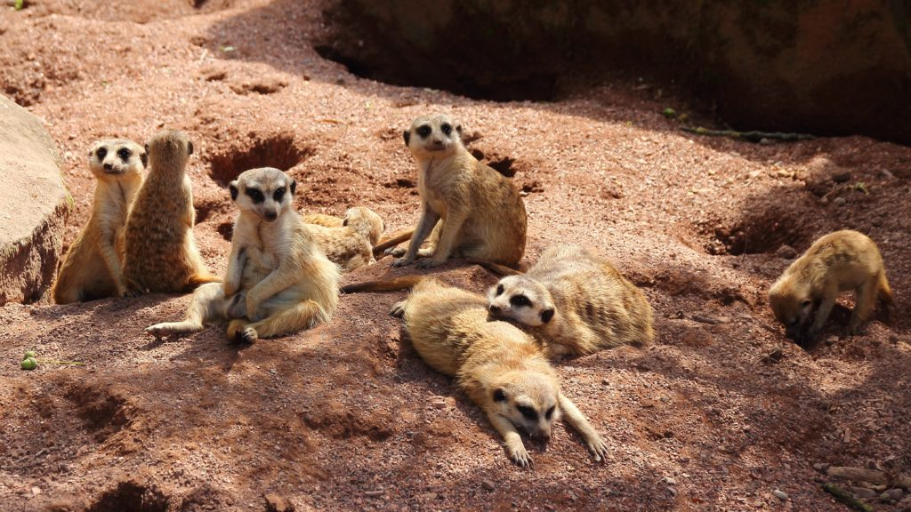
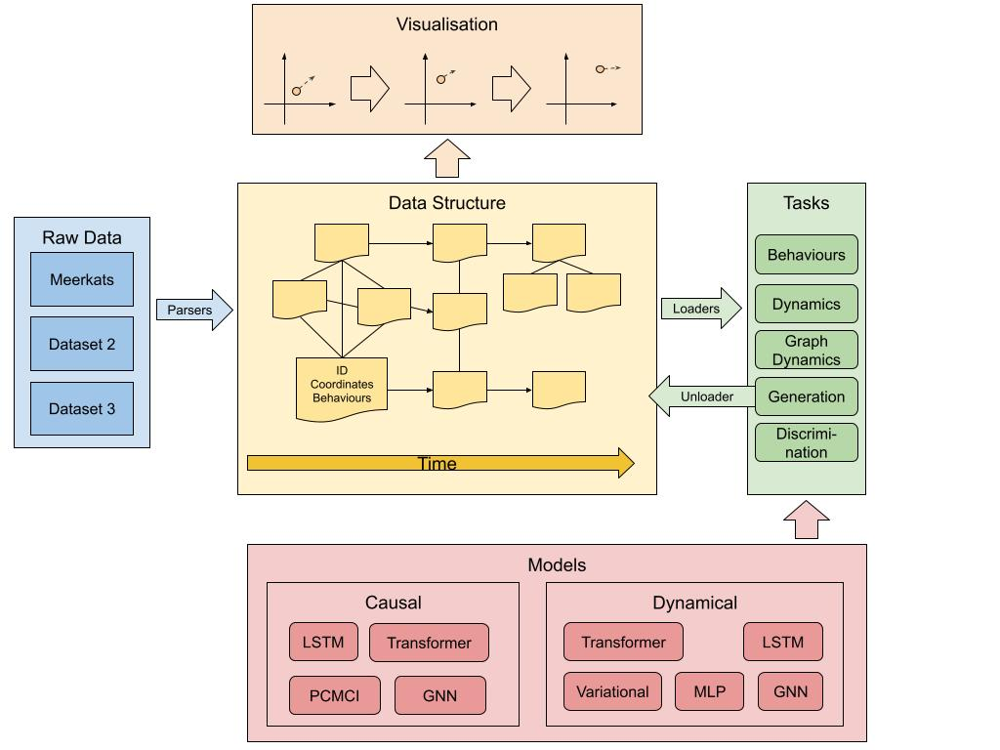
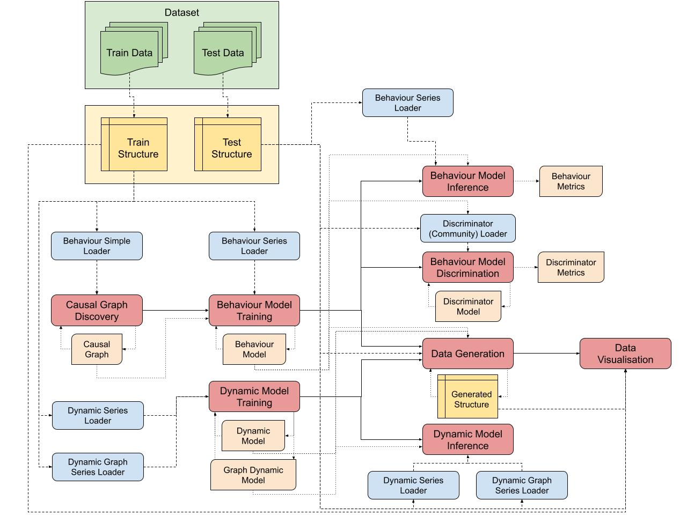

# Behavior Causal Discovery :paw_prints:

The Behavior Causal Discovery project aims to build causal models for communities of social animals. This repository provides tools to build behavioral causal models. Follow the instructions to build and evaluate the models. The data used in this project comes from the Meerkat Behaviour Recognition Dataset by [[Rogers et al., 2023]](https://arxiv.org/abs/2306.11326).

To learn more about the project, read our initial paper [here](https://arxiv.org/abs/2312.14333)!




## :rocket: Features

 - :white_check_mark: Causal Structure Discovery from categorical behavioral time series
 - :white_check_mark: Causal Inference with parametric neural models (GNN, LSTM, Transformer, ...)
 - :white_check_mark: Evaluation of the model against ground truth and baselines (accuracy, MI, credibility against discriminator)
 - :white_check_mark: Dynamical modelling of animal movements at individual and graph levels
 - :white_check_mark: Visualization of the temporal causal graph and simulation using trained models

The structure of the project is described below:




## :memo: Installation

Download the project:
```
git clone https://github.com/Strong-AI-Lab/behavior-causal-discovery.git
```

Install the dependencies inside a virtual environment (or don't):
```
python -m venv env
source env/bin/activate
pip install -r requirements.txt
```

## :dart: Run

### Causal Structure Discovery

Run the following script to learn a causal model. This method recovers only the structure of the causal graph. See the next section to learn the transition probabilities. The `data_path` is a mandatory argument that specifies the location of the data to be used. A folder can be provided. The `--model_save` argument loads an already learned model to re-generate the associated plots. The `--save_folder` argument specifies the folder where the results will be saved. The `--filter` argument specifies the filters to apply to the causal graph edges. The `--skip` argument specifies the plots to skip. The `--tau_max` argument specifies the maximum time lag to consider. The `--force_data_computation` argument forces the re-computation of the data structures, otherwise the structure is loaded from the cache if it exists. The `--fix_errors_data` argument fixes potential errors in the data. The `--filter_null_state_trajectories` argument filters the null states from the data. By default, stationary states in the data are skipped: the `--do_not_skip_stationary` argument disables this behavior. Use `--help` to get more details.
```
python src/run_discovery.py data_path \
  --model_save saved_model \
  --save_folder results/ \
  --filter filter_options \
  --skip skip_options \
  --tau_max N \
  --force_data_computation \
  --fix_errors_data \
  --filter_null_state_trajectories \
  --do_not_skip_stationary
```


### Causal Inference

Run the following script to train a parametric model for inference. The model can either be a baseline model or a neural-causal inference model from a `run_discovery.py` save. The `model_type` option specifies the kind of model to train. The `--model_save` can either be a pytorch checkpoint or a save from a causal discovery run. Wandb logging can be enabled with the `--wandb_project` option. The `--causal_graph` option specifies the causal graph options to use if the model is causal.
```
python src/train_model.py data_path \
  --model_type model_type \
  --model_save model_checkpoint.ckpt \
  --wandb_project my_project \
  --causal_graph causal_option \
  --filter filter_options \
  --tau_max N \
  --force_data_computation \
  --fix_errors_data \
  --filter_null_state_trajectories \
  --do_not_skip_stationary
``` 


### Behavior Modelling Evaluation

Load the model for behavior inference and evaluation.
```
python src/run_inference.py model_save data_path \
  --save_folder results/ \
  --model_type model_type \
  --filter filter_options \
  --tau_max N \
  --force_data_computation \
  --fix_errors_data \
  --filter_null_state_trajectories \
  --do_not_skip_stationary
```


### Discriminator Training and Evaluation

Train a discriminator to distinguish the simulation of behaviors generated by the model loaded with `model_save` from the real distribution given by the data loaded from `data_path`. You can load a trained discriminator with the `--discriminator_save` option, otherwise, provide data to train the discriminator with the `--train_data_path` option. The `--community` option enables generating behaviors for all agents in the series at once. Otherwise, the behaviors of each agent are generated separately (i.e. their neighbors are given by the ground truth).
```
python src/run_discriminator.py model_save data_path \
  --discriminator_save discriminator_checkpoint.ckpt \
  --train_data_path data/train/ \
  --discriminator_type model_type \
  --community \
  --filter filter_options \
  --tau_max N \
  --force_data_computation \
  --fix_errors_data \
  --filter_null_state_trajectories \
  --do_not_skip_stationary
```


### Dynamical Model Training and Inference


Train a dynamical model from the data attempting to simulate the movements of the agents. The options behave similarly to the above scripts.
```
python src/train_dynamics.py data_path \
  --model_type model_type \
  --model_save model_checkpoint.ckpt \
  --wandb_project my_project \
  --tau_max N \
  --force_data_computation \
  --fix_errors_data \
  --filter_null_state_trajectories \
  --do_not_skip_stationary
```

Test the model for inference with the following script:
```
python src/run_dynamics.py model_save data_path \
  --model_type model_type \
  --wandb_project my_project \
  --tau_max N \
  --force_data_computation \
  --fix_errors_data \
  --filter_null_state_trajectories \
  --do_not_skip_stationary
```


### Simulation

You can simulate a community of agents using your trained behavioral and dynamical models using the following script. The `structure` mandatory argument specifies the initial series to continue from. The structure must be under `json` format and correspond to the intermediate structure generated by the framework (illustrated in yellow in the project illustration diagram). By default, the intermediate structures generated from the data are stored in `data/gen/`. The `--mode` option specifies the simulation mode: the `dynamic` mode simulates the movements of the agents while leaving the behaviors unchanged; the `graph` mode is similar but uses modesl performing at the graph level for this task; the `behavior` mode simulates the behaviors of the agents while leaving the movements unchanged. Modes combining the modles are currently under development. The `--nb_steps` option specifies the number of steps to simulate.
```
python src/run_generation.py model_save structure \
  --mode mode \
  --model_type model_type \
  --nb_steps S \
  --save_folder data/gen/ \
  --tau_max N
```


### Visualization

The data and simulated series can be vizualised using the following script.
```
python src/run_visualization.py structure \
  --save_folder visualizations/ \
  --save_name name \
  --maxT T \
  --show_neighbours \
  --show_vision_field \
  --fps
```


Example of visualisation from the Meerkats dataset:


### Summary

Here is a summary of the interactions between the scripts, data, and models in the project:



## :book: Citations

If you use this project, please cite the following paper [1] ([Arxiv link](https://arxiv.org/abs/2312.14333), [AAMAS proceedings](https://www.ifaamas.org/Proceedings/aamas2024/pdfs/p2276.pdf), [ACM proceedings](https://dl.acm.org/doi/abs/10.5555/3635637.3663132)):
```
@inproceedings{DBLP:conf/atal/GendronCRLAHVKO24,
  author       = {Ga{\"{e}}l Gendron and
                  Yang Chen and
                  Mitchell Rogers and
                  Yiping Liu and
                  Mihailo Azhar and
                  Shahrokh Heidari and
                  David Arturo Soriano Valdez and
                  Kobe Knowles and
                  Padriac O'Leary and
                  Simon Eyre and
                  Michael Witbrock and
                  Gillian Dobbie and
                  Jiamou Liu and
                  Patrice Delmas},
  editor       = {Mehdi Dastani and
                  Jaime Sim{\~{a}}o Sichman and
                  Natasha Alechina and
                  Virginia Dignum},
  title        = {Behaviour Modelling of Social Animals via Causal Structure Discovery
                  and Graph Neural Networks},
  booktitle    = {Proceedings of the 23rd International Conference on Autonomous Agents
                  and Multiagent Systems, {AAMAS} 2024, Auckland, New Zealand, May 6-10,
                  2024},
  pages        = {2276--2278},
  publisher    = {International Foundation for Autonomous Agents and Multiagent Systems
                  / {ACM}},
  year         = {2024},
  url          = {https://dl.acm.org/doi/10.5555/3635637.3663132},
  doi          = {10.5555/3635637.3663132},
  timestamp    = {Wed, 26 Jun 2024 14:06:50 +0200},
  biburl       = {https://dblp.org/rec/conf/atal/GendronCRLAHVKO24.bib},
  bibsource    = {dblp computer science bibliography, https://dblp.org}
}
```

[1] Gendron, G., Chen, Y., Rogers, M., Liu, Y., Azhar, M., Heidari, S., Valdez, D.A.S., Knowles, K., O’Leary, P., Eyre, S. and Witbrock, M., Behaviour Modelling of Social Animals via Causal Structure Discovery and Graph Neural Networks. In Proceedings of the 23rd International Conference on Autonomous Agents and Multiagent Systems, AAMAS 2024, Auckland, New Zealand, May 6-10, 2024, pp. 2276-2278.